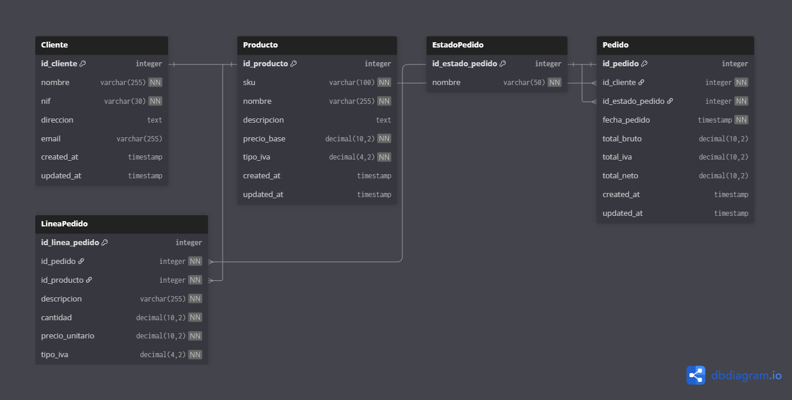

# MINIERP
Este proyecto consiste en desarrollar una MiniERP básica con Django para gestionar ventas. La idea es tener un sistema que permita registrar clientes, productos y pedidos, con su respectivo panel de administración para poder gestionar todo desde el Django Admin

## **1. Tecnologías utilizadas**


## **2. Modelado de Datos**
### 2.1 Clasificar entidades

```markdown
## Entidades Maestros (Catálogos) - `core/models.py`

Son datos estables que sirven de referencia:

- **Cliente**: Datos fiscales y de contacto del cliente
- **Producto**: Información de productos (SKU, precio, IVA)
- **EstadoPedido**: Estados posibles de un pedido (BORRADOR, CONFIRMADO, etc.)

## Entidades Transaccionales (Movimientos) - `ventas/models.py`

Son operaciones del día a día, voluminosas y con fecha:

- **Pedido**: Cabecera del pedido (quién, cuándo, total)
- **LíneaPedido**: Detalle de cada producto en el pedido
```
### 2.2 Relaciones y cardinalidades
```markdown

1. **Cliente → Pedido** (1:N)
   - Un cliente puede tener MUCHOS pedidos
   - Un pedido pertenece a UN solo cliente
   - FK: `pedido.id_cliente → cliente.id`

2. **EstadoPedido → Pedido** (1:N)
   - Un estado se aplica a MUCHOS pedidos
   - Un pedido tiene UN solo estado
   - FK: `pedido.id_estado_pedido → estadopedido.id`

3. **Pedido → LineaPedido** (1:N)
   - Un pedido tiene MUCHAS líneas (productos)
   - Una línea pertenece a UN solo pedido
   - FK: `lineapedido.id_pedido → pedido.id`

4. **Producto → LineaPedido** (1:N)
   - Un producto puede aparecer en MUCHAS líneas
   - Una línea tiene UN solo producto
   - FK: `lineapedido.id_producto → producto.id`

```
### 2.3 Políticas de Borrado (ON_DELETE)
He configurado las políticas de borrado pensando en mantener la integridad de los datos:

- **Cliente → Pedido (RESTRICT)**: No se puede borrar un cliente que tenga pedidos históricos. Esto protege la trazabilidad de las ventas.
- **EstadoPedido → Pedido (RESTRICT)**: No se puede borrar un estado que esté siendo usado por algún pedido. Los estados son catálogo maestro estable.
- **Pedido → LineaPedido (CASCADE)**: Si borro un pedido (por ejemplo, uno de prueba en borrador), automáticamente se borran todas sus líneas. Esto evita líneas huérfanas.
- **Producto → LineaPedido (RESTRICT)**: No puedo borrar un producto que aparezca en alguna línea de pedido. Esto preserva el histórico de ventas.

### 2.4 Snapshots (Datos Históricos)
Si dentro de 2 años cambio el precio de un producto, necesito saber que en X momento lo vendí a ese precio. 
Sin snapshots, perdería esa información histórica.

- `lineapedido.descripcion`: Nombre del producto en ese momento (el nombre puede cambiar después)
- `lineapedido.precio_unitario`: Precio aplicado en ese pedido (el precio actual puede ser diferente)
- `lineapedido.tipo_iva`: % de IVA vigente en ese momento (las leyes fiscales pueden cambiar)

### 2.5 Restricciones Adicionales
**Campos UNIQUE (evitan duplicados)**:
- `cliente.nif`: No puede haber dos clientes con el mismo NIF/CIF
- `cliente.email`: No puede haber dos clientes con el mismo email
- `producto.sku`: Cada SKU identifica un producto único
- `estadopedido.nombre`: No puede haber estados duplicados

**Constraint CHECK (validación de negocio)**:
- `lineapedido.cantidad > 0`: No se pueden crear líneas con cantidad negativa o cero
- Implementado mediante `CheckConstraint` en la clase `Meta` de `LineaPedido`

**Campos de auditoría (timestamps)**:
- `created_at`: Fecha de creación del registro (`auto_now_add=True`)
- `updated_at`: Fecha de última modificación (`auto_now=True`)
- Aplicados en Cliente, Producto y Pedido para trazabilidad

**Totales denormalizados en Pedido**:
- `total_bruto`: Suma de (precio_unitario × cantidad) de todas las líneas
- `total_iva`: Suma del IVA de todas las líneas
- `total_neto`: total_bruto + total_iva

Estos campos tienen `default=0` para evitar valores NULL y facilitar cálculos posteriores

### 2.6 Diagrama ER


## **3. Comandos Útiles**
```bash
# Activar entorno virtual
.\venv\Scripts\activate

# Desactivar entorno virtual
deactivate

# Levantar servidor de desarrollo
python manage.py runserver
Acceder al panel de administración en: **http://127.0.0.1:8000/admin**

# Crear migraciones tras cambios en models.py
python manage.py makemigrations

# Aplicar migraciones
python manage.py migrate

# Crear superusuario
python manage.py createsuperuser

```
## KPI: Tasa de Conversión (CRM)

La tasa de conversión mide el porcentaje de oportunidades que terminan en venta.

Fórmula:

Tasa de Conversión = (Oportunidades Ganadas / Total Oportunidades) × 100

Ejemplo:

Si hay 10 oportunidades y 3 están en estado "Cerrada Ganada":

Tasa de conversión = (3 / 10) × 100 = 30%

En el sistema, se calcula contando:
- Total de oportunidades
- Oportunidades con etapa = CERRADA_GANADA

## Licencia
Proyecto escolar de DAM Curso 2025–2026.
